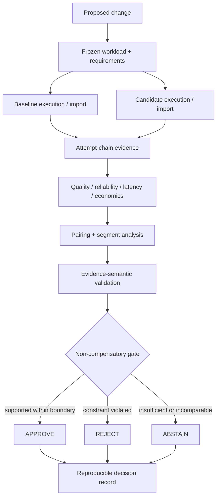

# InferenceLedger

**Auditable decisions for model, provider, and execution-policy changes.**

## Reference snapshot

This repository is a **dated evidence and mechanism snapshot**. It is not the current canonical
engineering repository and is not a second source of truth.

Canonical engineering, living status, and Task-5 acquisition materials are maintained in
[TensorScholar/inferenceledger](https://github.com/TensorScholar/inferenceledger).

This snapshot does not represent customer validation, commercial validation, production readiness,
or universal model or provider superiority.

Current canonical Task-5 boundary (recorded there, not claimed as work completed in this snapshot):

- external-pilot preparation has started;
- the concrete pilot is not frozen;
- execution readiness is blocked pending external facts;
- pilot execution has not started;
- provider/customer calls remain `0`;
- authorized paid spend remains `$0`.

InferenceLedger is a bounded inference-change assurance system that determines whether a specific
model, provider, or execution-policy change is supported against predeclared quality, reliability,
latency, and economic requirements for a defined workload and accounting basis, while preserving
reproducible evidence, uncertainty, and decision provenance.

It is not a gateway, leaderboard, generic evaluation platform, or FinOps product. Routing and
execution exist here to collect evidence.

## Architecture



The evidence core is intentionally sharper than the execution edge. Module mapping:
[`docs/architecture.md`](docs/architecture.md).

## Why averages are not a decision

| Principle | Consequence |
| --- | --- |
| Attempts are the economic unit | Request success does not erase failed or billable retries and fallbacks. |
| Unknown cost is not zero | A missing amount is incomplete evidence, not a free request. |
| Provenance ≠ comparability | Two reproducible fields may still be semantically incompatible. |
| Relative ≠ acceptable | Improvement can still fail an absolute floor or a critical segment. |
| History is immutable | Later interpretation does not rewrite a frozen decision. |
| Abstention is a result | `ABSTAIN` is valid; abstaining on everything has no decision utility. |

## Decision semantics

| Public decision | Gate state | Meaning |
| --- | --- | --- |
| `APPROVE` | `SHIP` | The proposed change is supported against the declared requirements **within the evidence boundary**. |
| `REJECT` | `NO_GO` | Declared requirements are violated by admissible evidence. |
| `ABSTAIN` | `REVIEW` or `INCONCLUSIVE` | The available evidence does not justify approval or rejection. |

`ABSTAIN` is not an error. It is the correct output when evidence is missing, ambiguous, or
incomparable. A gate that abstains on every change has no operational utility; conservative
abstention has to remain rare enough to be useful.

`APPROVE` is not a production-readiness certificate. It is only approval under the stated
workload, requirements, evidence semantics, and accounting basis.

The Change Gate still emits historical vocabulary (`SHIP`, `NO_GO`, `REVIEW`, `INCONCLUSIVE`).
The mapping above is the public contract; committed artifacts keep their original labels.

## Evidence already in the repository

Negative and inconclusive outcomes are retained. They are not rewritten into a success story.

| Experiment | What was observed | Recorded outcome |
| --- | --- | --- |
| [IFStruct JSON-mode change](benchmarks/reports/ifstruct-json-mode-20260911/decision.md) | 100/100 paired local successes, 0 retries, structure `0/100 → 0/100`, p50 `14226 → 9912 ms`. Local execution-stack cost is `0`; that is not provider-invoice evidence. | `INCONCLUSIVE` — required cost checks had no variation. |
| [Synthetic JSON-mode change](benchmarks/reports/local-json-mode-20260911/decision.md) | 32 pairs. Exact-field quality `0/32 → 8/32`; candidate mean successful latency `+137.40625 ms`. Declared pre-registration was not independently Git-proven. | `INCONCLUSIVE` — required checks remained review/inconclusive. |
| [OpenRouter billing reconciliation](benchmarks/reports/openrouter-billing-reconciliation-6b-20260911T220449Z/decision.md) | 50/50 paid gateway successes, 0 retries. Four frozen monetary rules matched; the frozen token-field rule did not. Dedicated-key usage delta `$0.00070845`. | `VALIDATED_MISMATCH` — not direct OpenAI ledger or invoice validation. |

Claim boundaries and the artifact map: [`docs/evidence.md`](docs/evidence.md). Publication-only
path sanitization is disclosed in
[`benchmarks/PUBLICATION_REDACTIONS.json`](benchmarks/PUBLICATION_REDACTIONS.json). No experiment
metric, threshold, decision, timing, usage, or cost field was changed by that sanitization.

## Walkthrough: IFStruct JSON-mode change

This is the inspection path in this snapshot. It is useful because it is **not** a clean win:
latency improved, request success was complete, and the gate still abstained.

No provider credentials are required. Open these files in order:

| Stage | Artifact |
| --- | --- |
| Frozen experiment | [`experiment.json`](benchmarks/experiments/ifstruct-json-mode-20260911/experiment.json) |
| Workload identity | [`ifstruct-v1.0-json-wrapper-n100.jsonl`](benchmarks/workloads/ifstruct-v1.0-json-wrapper-n100.jsonl) |
| Baseline / candidate | prompt-only vs `response_format=json_object`, defined in the experiment file |
| Attempt evidence | [`…-baseline.jsonl`](benchmarks/reports/ifstruct-json-mode-20260911/ifstruct-json-mode-20260911-baseline.jsonl), [`…-candidate.jsonl`](benchmarks/reports/ifstruct-json-mode-20260911/ifstruct-json-mode-20260911-candidate.jsonl) |
| Quality / reliability / latency / economics | [`decision.md`](benchmarks/reports/ifstruct-json-mode-20260911/decision.md) |
| Pairing | [`pairing-audit.json`](benchmarks/reports/ifstruct-json-mode-20260911/pairing-audit.json) — 100/100 pairs |
| Statistics + gate | [`paired-evidence.json`](benchmarks/reports/ifstruct-json-mode-20260911/paired-evidence.json), [`change-gate.json`](benchmarks/reports/ifstruct-json-mode-20260911/change-gate.json) |
| Decision | [`decision.json`](benchmarks/reports/ifstruct-json-mode-20260911/decision.json) → `INCONCLUSIVE` |

`change-gate.json` records `pass_count=6`, `fail_count=0`, `inconclusive_count=2`. The two required
cost checks are inconclusive because paired execution-stack cost had no variation. Favorable
latency does not offset that: the gate is an intersection.

## Quickstart

Supported Python: `3.11` and `3.12`. Local validation in this snapshot:

```bash
python3.12 -m venv .venv
.venv/bin/python -m pip install -e ".[dev,providers]"
make check
```

Inspect the committed IFStruct bundle without any provider call:

```bash
.venv/bin/python scripts/audit_decision_completeness.py \
  --decision-json benchmarks/reports/ifstruct-json-mode-20260911/decision.json
```

Expected:

```text
contract=decision-evidence-completeness-v1 satisfied=true present=14 explicitly_unavailable=0 missing=0 missing_checks=-
```

That result means required evidence surfaces are represented. It does **not** mean the evidence is
favorable: the same record remains `INCONCLUSIVE`. Completeness is not sufficiency.

`make check` never performs live provider execution. This snapshot preserves the historical
reference CLI surface: `inferenceledger-smoke` and the compatibility alias `inference-smoke`.
They are reference-executor utilities, not the decision interface. The current canonical
distribution CLI `inferenceledger` is maintained in
[TensorScholar/inferenceledger](https://github.com/TensorScholar/inferenceledger). Do not treat
this snapshot's entry points as the current install identity. Provider credentials are needed
only for optional live runs; do not commit secrets.

Details: [`docs/development.md`](docs/development.md).

## Limitations

```text
ENGINEERING VERIFIED
```

This banner applies to **mechanisms and committed artifacts in this reference snapshot**. It does
not mean production-ready, customer validated, externally validated, or commercially validated.
Later canonical engineering (including Tasks 1–4 on the first comparative external-pilot path, and
Task-5 preparation) is recorded in
[TensorScholar/inferenceledger](https://github.com/TensorScholar/inferenceledger) and is not
claimed as completed by this snapshot.

Committed mechanisms and retained experiments in this snapshot: attempt-chain accounting, explicit
pricing provenance, acquisition semantics, pairing, segmentation, exact/paired statistics,
absolute quality floors, non-compensatory gates, unknown/incomplete evidence handling, immutable
historical decisions, and reconciliation semantics.

```text
EXTERNAL / CUSTOMER / EMPIRICAL VALIDATION NOT YET ESTABLISHED
```

The repository does not yet demonstrate external decision-owner value, superiority to a strong
conventional workflow, generalized provider billing truth, customer or commercial validation, or
broad production impact.

Scope boundaries that are already visible in the committed artifacts:

- workloads are synthetic, published-reference, or controlled validation traffic—not customer production;
- the OpenRouter experiment validates one gateway reconciliation surface, not a provider ledger or invoice;
- the IFStruct run measures this repository's JSON-path structural checks, not broad semantic quality or an official leaderboard score;
- gateway-era routing, batching, caching, and reference execution remain as supporting mechanisms.

## Repository map

```text
src/          core implementation
tests/        correctness and evidence-semantics tests
benchmarks/   frozen workloads, experiment definitions, retained evidence
scripts/      reproducible experiment / comparison / decision-audit utilities
docs/         architecture, evidence model, development, historical protocols
```

## License

MIT for repository code unless a nested artifact states otherwise. The redistributed IFStruct
subset under `benchmarks/references/ifstruct-v1.0/` retains its Apache-2.0 license and upstream
provenance.
